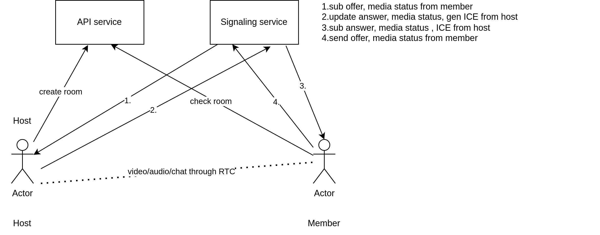

## Design


## Setup 
```bash
sudo apt-get install libboost-all-dev build-essential g++ cmake -y
git clone --recursive https://github.com/HuongNV96/webrtc-p2p.git
```

## Develop Deployment
```bash
sudo apt-get install libboost-all-dev build-essential g++ cmake -y
mkdir build
cd build
cmake ..
make
cp api/static build/api
cd build
./api/api-server
./signaling/sinaling_server
```

## Docker Deployment
```bash
docker-compose up -d
```
